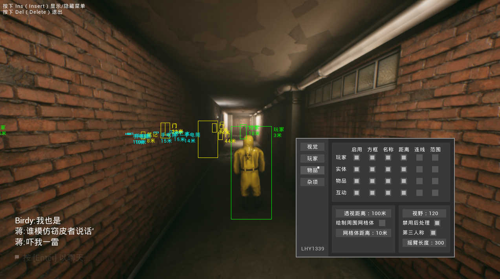
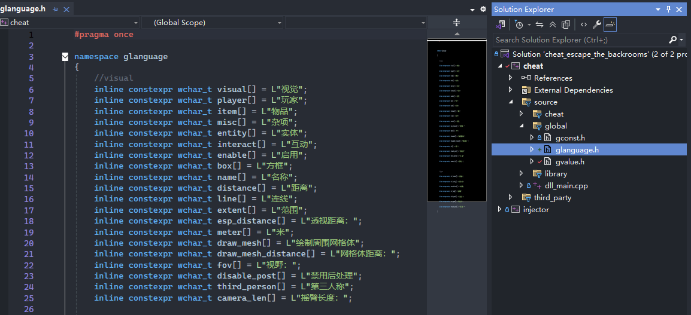
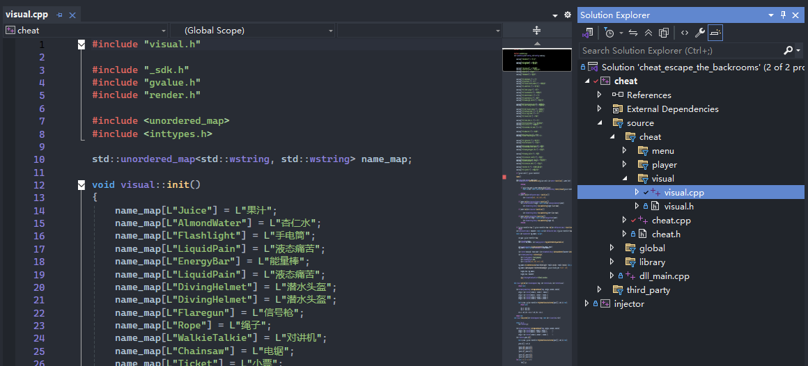

## Escape The Backrooms Cheat - 逃离后室外挂修改器
### 效果图

### 如何使用修改器？
- 点击Release下载最新版本
- 解压到文件夹
- 运行 `injector.exe`
- 打开游戏
- 按下F5加载修改器（不要重复点击！！！不然会出bug！！！）
### 如何使用/修改源码
- 下载Code
- 解压到文件夹
- 使用 `VS2022` 打开（
- 添加、修改代码
- 切换模式为 `Release x64` 
- 编译
### How To Support For More Language
##### Way 1
- Send me an email telling me which languages you need
- I will send back the cheat in 2 days
##### Way2
- Download code
- Unzip to your folder
- Open it with `VS2022`
- Change `source/global/glanguage.h`

- Change `source/cheat/visual/visual.cpp` 

- Change build mode to `Release x64`
- Build the solution
### 技术支持（Support）
任何问题、BUG反馈、催更、新功能建议
- QQ：`3201548104`
- EMail1：`3201548104@qq.com`
- EMail2：`lhy1339@gmail.com`